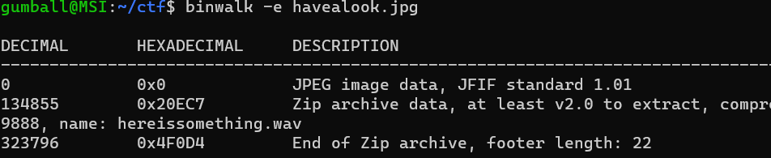
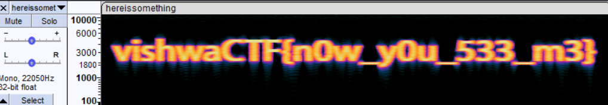

# Can you see me?

Points: 112

Category: Steganography

Difficulty: Easy

## Description
A magician made the seven wonders disappear. But people claim they can still feel their presence in the air

## Solution

I tried file and exiftool command first, and it didn’t show anything particularly interesting. So the next step would be to try binwalk. We see there is a zip file hidden in there, so we extracted that. 

The unzipped file includes a wave file, “hereissomething.wav”.

Now let’s just listen to the wav file. I used Audacity for this. 

If you listen to the wav file, it just sounds like a whole lot of nothing. I bet there is something that causes the sound to be so weird though. So, I changed the view to Spectrogram, and now I can see the flag.

vishwaCTF{n0w_y0u_533_m3}

