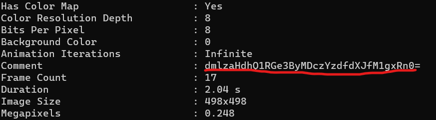

# Guatemala

Points: 100 Points

Category: Steganography

Difficulty: Easy

## Description
My friend wanted to install an antivirus for his computer, but the creator of the antivirus was caught! 

Given Attached file: AV

## Solution
There is an attached file, called AV. The first thing I notice is there is no extension. So, of course let’s use exiftool and see. 

Immediately we see the metadata comment.
dmlzaHdhQ1RGe3ByMDczYzdfdXJfM1gxRn0= 

And it’s obvious that it is base64. After decoding it, we get the flag.

vishwaCTF{pr073c7_ur_3X1F}

