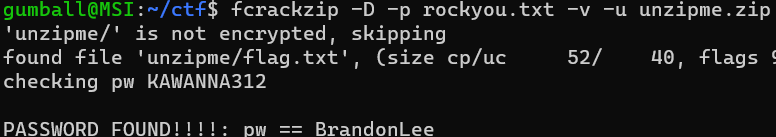
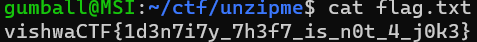

# The Sender Conundrum

Points: 145

Category: Forensics

Difficulty: Easy

## Description
Marcus Got a Mysterious mail promising a flag if he could crack the password to the file.

Given Attachments: TheEmail.eml and unzipme.zip

## Solution

Honestly, the email is not so important. And I didn’t really take a look at it. The more important part of this is the zip file. We can use fcrackzip, and use the simple rockyou.txt file. 
It’s a really simple crack, and not anything extra like recursive zip files, or difficult passwords. 

After about 6 minutes, we found the password. Let’s unzip the file with the pass now.

Unzipping the file and cd’ing into the unzipme directory, we can take a look at the flag.txt.

vishwaCTF{1d3n7i7y_7h3f7_is_n0t_4_j0k3}
