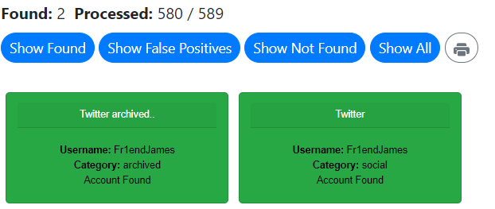
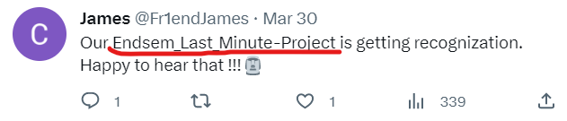
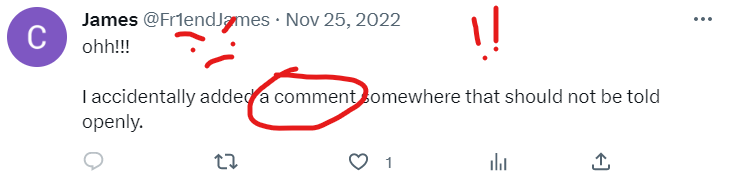
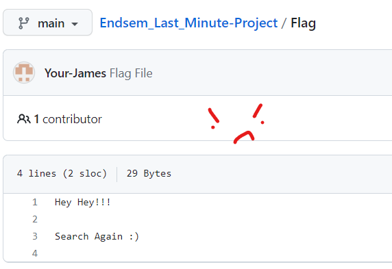
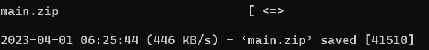
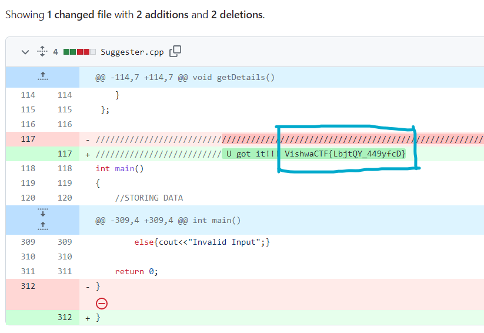

# Fr1endship Forever

Points: 294

Category: OSINT

Difficulty: Medium

## Description
This is going to be a double hunt... My childhood Fr1end James has posted something about the project he made on his socials (just to flaunt). Today is our submission day and my Fr1end James is absent. 

Yesterday when we met him, he told me, "Mark, can you submit my project also with yours, as I will be going out of the city tomorrow morning." 

He forgot to tell me anything about his project. He is not even picking up my phone. Help me find him and of course his project. 

## Solution

Ok, so the first thing we notice of course, it’s the strange spelling of Friendship. It is spelled as Fr1end. This will probably narrow it down, when it comes to trawling for the correct user on the internet. We know the target’s name is James. So what can his username be? I went with the obvious: “Fr1endJames”. A good site for finding usernames for OSINT is whatsmyname.app

https://whatsmyname.app/

Very simple search, and we already have his social media. Ok, so let’s check his Twitter. 

In the CTF description, this must be the project that Mark is talking about. So this is the first important tweet from James.

Here is the second important tweet from James. He is most likely talking about a Github commit comment or something like that. So the next step is to check Github. 
Looking at Github and just typing the project into the search bar, you can get the repository. 

https://github.com/Your-James/Endsem_Last_Minute-Project

Now, we have to find the flag, and we are close.

Unfortunately, one of the files is named “Flag”, but it is not the right one. So we have to keep looking. I decided to wget the entire repository in zip form, and hopefully just grep for it. 

Unfortunately, grepping through the entire directory did not work. There was no mention of “ctf”, “flag”, or “pass”. I decided to go back to the repository, and MANUALLY look through the commits. Luckily there was only 21 commits, because if there were like 100 I would have thrown my laptop across the room. Remember, James said “oops”, so maybe he had committed a delete in one of the files. 

I started checking manually, and it was surprisingly fast, after about 1 minute, Suggester.cpp turned out the flag! 

James had added this text “accidently” and deleted it very quickly, that’s why the main repo files did not show the flag through grep.

The flag is: VishwaCTF{LbjtQY_449yfcD}
